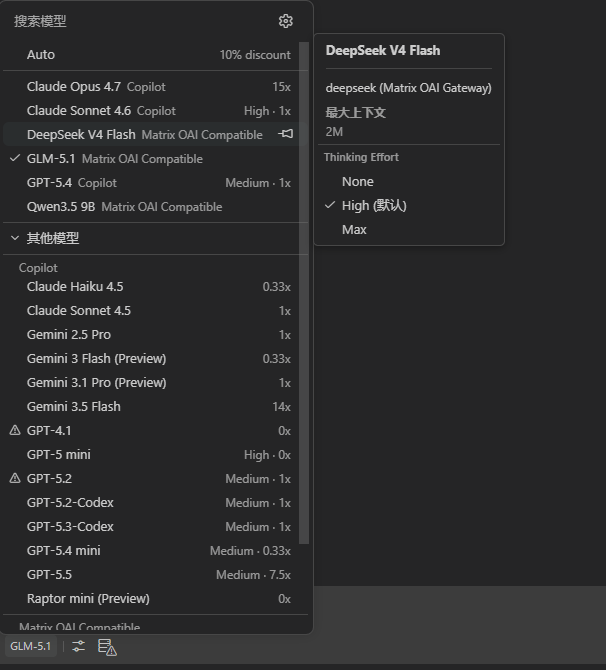
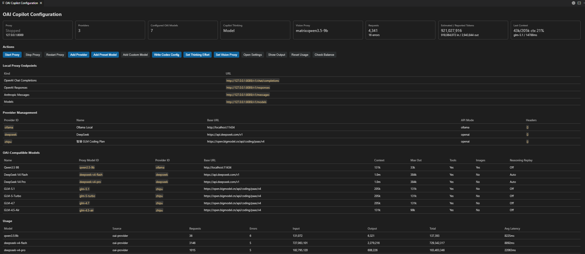
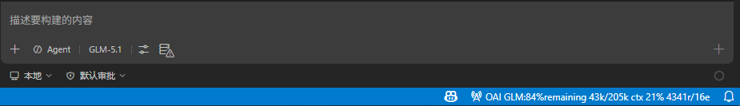
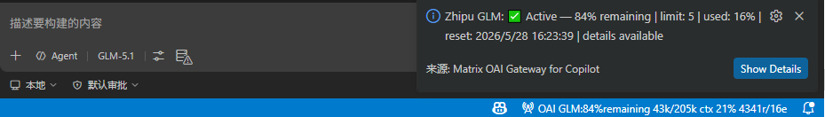

<div align="center">

# 🌌 Matrix OAI Gateway for Copilot

### Pick **any OpenAI-compatible model** from the Copilot Chat model picker — and keep everything else Copilot already gives you.

[](https://github.com/liuyudong2025-arch/oai-compatible-copilot-provider)
[](https://github.com/liuyudong2025-arch/oai-compatible-copilot-provider/blob/main/LICENSE)
[](https://code.visualstudio.com)

**No new sidebar. No new chat UI.** Just bring your own API key, pick your model, and keep using Copilot's agent mode, tool calling, and polished UI — powered by DeepSeek, Gemini, Claude, Qwen, GLM, Ollama, or any OpenAI-compatible provider.

[English](#features) · [中文](#功能一览)

</div>

---

## Why Matrix OAI Gateway?

Don't replace Copilot — **power it up**. This extension plugs directly into VS Code's language model provider API, so your custom models appear in the **same model picker** you already use every day. Agent mode, tool calling, Explore subagents, thinking mode — all preserved.

> 💡 **Two-way gateway**: it also exposes a **local proxy** (`/v1/chat/completions`, `/v1/responses`, `/v1/messages`), so external tools like Codex CLI, Continue, or curl can reach your models — or even VS Code's built-in Copilot models — through a single HTTP endpoint.

---

## ✨ Features

<table>
<tr>
<td width="50%">

### 🤖 Copilot Chat Integration
Models appear directly in the Copilot Chat model picker. Full support for:
- **Agent mode** & tool calling
- **Vision proxy** for text-only models
- **Thinking / reasoning mode** (DeepSeek, etc.)
- **Explore subagent** routing

</td>
<td width="50%">

### 🔌 Local Proxy Server
Expose models through standard OpenAI-compatible HTTP APIs:
- `/v1/chat/completions`
- `/v1/responses` (Codex CLI)
- `/v1/messages` (Anthropic)
- `/v1/models` & `/health`

</td>
</tr>
<tr>
<td width="50%">

### 💰 Balance & Usage Tracking
- **7+ providers** supported (DeepSeek, OpenAI, OpenRouter, GLM, SiliconFlow, Groq, Mistral…)
- Auto-refresh every N minutes in the status bar
- Per-model latency, token usage, error count in the config panel

</td>
<td width="50%">

### ⚡ One-Click Preset Models
15+ preset models ready to go:
- DeepSeek V4 Pro / Flash
- GPT-4.1 / GPT-4o Mini
- Gemini 2.5 Pro / Flash
- Qwen, GLM, Kimi, Groq, Ollama…

</td>
</tr>
<tr>
<td width="50%">

### 🧠 DeepSeek Thinking Mode
Automatic `reasoning_content` replay for multi-turn tool-calling conversations. No more `invalid_request_error` when using DeepSeek reasoning models with Copilot Agent.

</td>
<td width="50%">

### 🔐 Secure Key Management
API keys stored in **VS Code Secret Storage**, never logged, never exposed in the config panel. Headers are auto-redacted in the UI.

</td>
</tr>
</table>

---

## 📸 Screenshots

 

 

---

## 🚀 Quick Start

### 1. Install the extension

Search **"Matrix OAI Gateway"** in the VS Code Extensions marketplace, or install from [VSIX](https://github.com/liuyudong2025-arch/oai-compatible-copilot-provider).

### 2. Add a provider & set API key

Open Command Palette (`Ctrl+Shift+P`):

```
Matrix OAI Gateway: Add Provider    → e.g. DeepSeek, https://api.deepseek.com/v1
Matrix OAI Gateway: Set API Key     → paste your key
```

### 3. Add a model (or use presets)

```
Matrix OAI Gateway: Add Preset Model  → pick from 15+ presets
Matrix OAI Gateway: Add Model         → custom model config
```

### 4. Start coding

Open Copilot Chat → click the model picker → select your model → done! 🎉

---

## ⚙️ Configuration

### Providers & Models

Providers are reusable endpoints. Models reference providers by `providerId`, so one provider can host many models.

```jsonc
// settings.json
"matrixOaiCopilot.providers": [
  {
    "id": "deepseek",
    "name": "DeepSeek",
    "baseUrl": "https://api.deepseek.com/v1",
    "apiMode": "openai",
    "headers": {}
  },
  {
    "id": "ollama",
    "name": "Ollama Local",
    "baseUrl": "http://localhost:11434",
    "apiMode": "ollama",
    "headers": {}
  }
],
"matrixOaiCopilot.models": [
  {
    "id": "deepseek-v4-pro",
    "name": "DeepSeek V4 Pro",
    "providerId": "deepseek",
    "family": "deepseek",
    "maxInputTokens": 1000000,
    "supportsTools": true,
    "thinking": { "type": "enabled" },
    "thinkingFormat": "deepseek",
    "reasoning_effort": "max"
  },
  {
    "id": "qwen3.5:9b",
    "name": "Qwen3.5 9B",
    "providerId": "ollama",
    "family": "qwen",
    "maxInputTokens": 131072,
    "supportsTools": true,
    "supportsImages": true,
    "enable_thinking": true,
    "thinking_budget": 8192
  }
]
```

### Key Settings

| Setting | Default | Description |
|---|---|---|
| `matrixOaiCopilot.requestTimeoutSeconds` | `300` | Global upstream timeout |
| `matrixOaiCopilot.stream` | `true` | Streaming responses |
| `matrixOaiCopilot.logLevel` | `"info"` | Log verbosity: `off` / `error` / `info` / `debug` |
| `matrixOaiCopilot.balanceRefreshMinutes` | `5` | Auto balance refresh interval |
| `matrixOaiCopilot.copilot.thinkingEffort` | `"model"` | Thinking effort: `model` / `none` / `high` / `max` |
| `matrixOaiCopilot.copilot.enableVisionProxy` | `true` | Describe images for text-only models |
| `matrixOaiCopilot.proxy.autoStart` | `false` | Auto-start local proxy |
| `matrixOaiCopilot.proxy.port` | `8080` | Proxy listen port |

---

## 💰 Balance Checking

Query your API key balance directly from VS Code — no browser needed.

**Supported providers:**

| Provider | Currency | Auto-detect |
|---|---|---|
| **DeepSeek** | CNY | ✅ |
| **OpenAI** | USD | ✅ |
| **OpenRouter** | USD | ✅ |
| **Zhipu GLM / BigModel** | tokens | ✅ |
| **SiliconFlow** | CNY | ✅ |
| **Groq** | — | ✅ |
| **Mistral** | EUR / USD | ✅ |

**How to use:**

1. Command Palette → `Matrix OAI Gateway: Check API Balance`
2. Select a provider → enter API key (if not stored)
3. View balance in the status bar 🟢

Balance auto-refreshes after startup (30s delay) and every N minutes. The status bar shows a provider prefix (`DS:`, `GLM:`, `OR:`) so you know whose balance is displayed.

---

## 🧠 DeepSeek Thinking Mode

DeepSeek reasoning models need `reasoning_content` passed back in tool-calling turns. VS Code hides this field, so this extension:

- Stores `reasoning_content` in memory between turns
- Reattaches it automatically before upstream calls
- Falls back to empty `reasoning_content` when the original text can't be recovered

**Model options:**

| Option | Values | Description |
|---|---|---|
| `thinkingFormat` | `auto` / `deepseek` / `always` / `none` | Controls reasoning replay |
| `reasoningContentFallback` | `true` / `false` | Send empty reasoning on missing turns |
| `reasoning_effort` | `high` / `max` | Thinking depth for DeepSeek V4 |

---

## 🔌 Local Proxy

When enabled, the proxy listens at `http://127.0.0.1:8080`:

| Endpoint | Protocol |
|---|---|
| `POST /v1/chat/completions` | OpenAI Chat Completions |
| `POST /v1/responses` | OpenAI Responses (Codex CLI) |
| `POST /v1/messages` | Anthropic Messages |
| `GET /v1/models` | Model listing |
| `GET /health` | Health check |

**Routing logic:** If `model` matches a configured OAI model → upstream provider. Otherwise → VS Code language model (e.g. Copilot).

### Codex CLI Example

```toml
# ~/.codex/config.toml
[model_providers.deepseek]
name = "DeepSeek"
base_url = "http://127.0.0.1:8080/v1"
experimental_bearer_token = "codex-deepseek-local"
wire_api = "responses"

[profiles.deepseek-v4-pro]
model_provider = "deepseek"
model = "deepseek-v4-pro"
```

---

## 🤖 Copilot Explore Subagents

GitHub Copilot Agent starts an internal Explore subagent for code search. This extension defaults it to your OAI model so it doesn't fall back to Copilot built-in models:

```jsonc
// Auto-configured by the extension
"chat.exploreAgent.defaultModel": "DeepSeek V4 Pro (matrix-oai-compatible)",
"chat.customAgentInSubagent.enabled": true
```

---

## 🎯 Preset Models (One-Click Setup)

| Provider | Model | Context | Tools | Vision |
|---|---|---|---|---|
| OpenAI | GPT-4.1 | 1M | ✅ | ✅ |
| OpenAI | GPT-4o Mini | 128K | ✅ | ✅ |
| DeepSeek | Chat / Reasoner | 64K | ✅ | — |
| Google Gemini | 2.5 Pro / Flash | 1M | ✅ | ✅ |
| Qwen DashScope | Qwen Plus | 128K | ✅ | — |
| Zhipu GLM | GLM-4 Plus | 128K | ✅ | — |
| OpenRouter | Custom Model | 128K | ✅ | — |
| Groq | Llama 3.3 70B | 128K | ✅ | — |
| Ollama | Qwen Coder 14B | 32K | ✅ | — |
| LM Studio | Local Model | 32K | — | — |
| Moonshot | Kimi 8K | 8K | ✅ | — |

---

## 📋 Commands

| Command | Description |
|---|---|
| `Matrix OAI Gateway: Configuration` | Open the config webview panel |
| `Matrix OAI Gateway: Add Provider` | Add a new upstream provider |
| `Matrix OAI Gateway: Add Preset Model` | Pick from 15+ preset models |
| `Matrix OAI Gateway: Add Model` | Add a custom model config |
| `Matrix OAI Gateway: Set API Key` | Store an API key securely |
| `Matrix OAI Gateway: Clear API Key` | Remove a stored API key |
| `Matrix OAI Gateway: Refresh Models` | Re-register models with VS Code |
| `Matrix OAI Gateway: Start Proxy` | Start the local proxy server |
| `Matrix OAI Gateway: Stop Proxy` | Stop the local proxy server |
| `Matrix OAI Gateway: Restart Proxy` | Restart the local proxy server |
| `Matrix OAI Gateway: Show Output` | Open the output log channel |
| `Matrix OAI Gateway: Open Settings` | Jump to extension settings |
| `Matrix OAI Gateway: Set Copilot Thinking Effort` | Override thinking mode |
| `Matrix OAI Gateway: Set Vision Proxy Model` | Choose image-description model |
| `Matrix OAI Gateway: Reset Usage` | Reset usage statistics |
| `Matrix OAI Gateway: Check API Balance` | Query API key balance |
| `Matrix OAI Gateway: Write Codex Config` | Generate Codex CLI config |

---

## ⏱️ Timeouts & Streaming

Slow reasoning models may need longer timeouts. Configure globally or per-model:

```jsonc
"matrixOaiCopilot.requestTimeoutSeconds": 300,  // global default

// Per-model override:
"matrixOaiCopilot.models": [
  {
    "id": "deepseek-reasoner",
    "requestTimeoutSeconds": 600,  // 10 min for thinking models
    "stream": true,
    "stream_options": { "include_usage": true }
  }
]
```

---

## 🔧 Compatibility

This extension supports:

- ✅ Any OpenAI-compatible `/chat/completions` endpoint
- ✅ Ollama native `/api/chat` (with tool-call support)
- ✅ VS Code language models via `vscode.lm`
- ✅ OpenAI-compatible proxy clients (curl, Continue, etc.)
- ✅ OpenAI Responses protocol (Codex CLI)
- ✅ Basic Anthropic Messages clients

Tool calling, image input, reasoning options, and token usage depend on the upstream model.

---

## 📄 License

[MIT](https://github.com/liuyudong2025-arch/oai-compatible-copilot-provider/blob/main/LICENSE)

---

<div align="center">

**Enjoying Matrix OAI Gateway?** ⭐ [Star on GitHub](https://github.com/liuyudong2025-arch/oai-compatible-copilot-provider) · 🐛 [Report Issues](https://github.com/liuyudong2025-arch/oai-compatible-copilot-provider/issues)

</div>

---

## 功能一览

Matrix OAI Gateway 可以把任意 OpenAI 兼容模型接入 VS Code / Copilot Chat，同时把 VS Code 里的语言模型反向暴露成本地 OpenAI / Anthropic 兼容接口。

**核心特性：**

- 🤖 **Copilot Chat 无缝集成** — 模型直接出现在 Copilot 模型选择器里，支持 Agent 模式、工具调用、Vision 代理、思考模式
- 🔌 **本地代理服务器** — 暴露 `/v1/chat/completions`、`/v1/responses`、`/v1/messages` 接口，支持 Codex CLI、Continue、curl 等外部工具
- 💰 **余额查询** — 支持 DeepSeek、OpenAI、OpenRouter、智谱 GLM、SiliconFlow、Groq、Mistral 等 7+ 供应商，状态栏自动刷新
- 🧠 **DeepSeek 思考模式** — 自动回放 `reasoning_content`，解决工具调用多轮对话的 `invalid_request_error`
- ⚡ **一键预设模型** — 15+ 预设模型（DeepSeek V4、GPT-4.1、Gemini 2.5、Qwen、GLM、Kimi、Groq、Ollama…）
- 🔐 **安全密钥管理** — API Key 存入 VS Code Secret Storage，永不记录日志，配置页自动脱敏
- 📊 **用量统计** — 状态栏显示端口、余额、上下文用量、请求数、错误数；配置页显示模型级延迟和 token 用量
- 🤖 **Explore 子代理** — 自动将 Copilot Explore 子代理路由到你的 OAI 模型，避免回退到 GPT-4.1
- 🖼️ **Vision 代理** — 文本模型也可以处理图片，自动用另一个视觉模型描述图片内容
